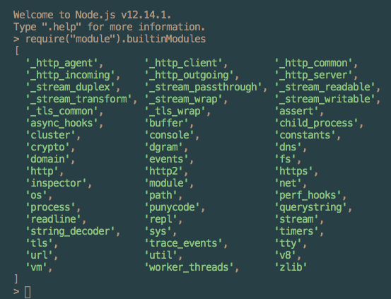

# Node.js
- off-browser JavaScript environment invented by Ryan Dahl in 2009
- JavaScript runtime
  - environment that allows execution of JavaScript code outside of the browser
  
**Runtime:** converts code written in a high-level, human-readable, programming language and compiles it down to code the computer can execute  

---
### [Codecademy Article: Setting Up Node Locally](https://www.codecademy.com/content-items/c4fe3060dbc61fc82d810c4ea06c29a8)
Learn how to download Node on your local machine, so you can use the powerful Node.js runtime from your own computer. 

---

## REPL
- abbreviation for Read-Evaluate-Print Loop
- program that loops through three different states:
  - **read** state where the program reads input from a user
  - **eval** state where the program evaluates the user’s input
  - **print** state where the program prints out its evaluation to a console
  - **loops** through these states again

## JavaScript REPL
- built-in upon Node installation
- access by typing `node` into the terminal
- `>` character at prompt indicates the REPL is running
- indicate the input is ready for eval when you hit `enter`
- for evaluation of multiple lines type `.editor` after the prompt and type `control D` when the input is ready to be evaluated
- each session is a single shared memory, variables and functions are accessible until the REPL is exited

---
## Running a Program in Node
1. Create a file with a `.js` extension
2. Open that file with a text editor and add code to the file
3. Open the terminal and navigate to the directory containing the file to run
4. Type node and then the file name.js into the terminal
5. The results of the program will print to the terminal
---

**Process:** the instance of a computer program that is being executed

#### `process.env`
- global process object in node that stores and controls information about the environment
- may have `if/else` logic to perform tasks when the process isn't live to users

*Example:*

`PWD` 
- holds a string indicating the directory with the location of the current process

*Example:*
- add a property with key of `NODE_ENV` to `process.env` 
- insert value of either `production` or `development`

*Example:*  

`process.memoryUsage()` returns information about the CPU demands of the current process

**Heap:** a block of computer memory
- can also be a data structure

*Example:*

`process.memoryUsage().heapUsed` returns a number representing bytes of memory the current process is using

*Example:*  
`process.argv` holds an array of command line values for when the current process was initiated
  - first element is the absolute path to Node
  - second element is the path to the file currently running
  - following elements are command line arguments provided when the process was initiated
---
Full documentation is here:  
[Process Object Documentation: Node.js v14.4.0 Documentation](https://nodejs.org/api/process.html) 

Viewing the Node.js core modules:
---
**Modularity:** software design technique where one program has distinct parts each providing a single piece of the overall functionality
- essential for creating scalable programs which incorporate libraries and frameworks 
- separate the program’s concerns into manageable chunks

**Module:** module is a collection of code located in a single file
- distinct part providing a single piece of the overall functionality

`require()` - function used to combine modules into a complete program
- can use either core modules or functions created by the programmer
  - first checks if the argument is a core module
  - then, if not a core module, attempts to locate it elsewhere
    - local modules are required by passing in the path to the module (file)

**Core Modules:** modules included in the Node the environment to efficiently perform common tasks
- located in the `lib/folder`
- required by passing a string with the name of the module into the `require()` function

Viewing the Node.js core modules:

`module.exports` : special JavaScript object in each JavaScript file in the Node environment
- holds everything in the file (a module) that is available for other files to `require()`

**Node Package Manager (NPM):**  online collection, or registry, of software written and shared by other developers
- includes frameworks like `express` or `react`

**nodemon:** tool that helps develop node.js based applications by automatically restarting the node application when file changes in the directory are detected.  
[Website: nodemon](https://www.npmjs.com/package/nodemon)

## Event Driven Architecture  

**Imperative programming:** give the computer a series of instructions to execute in a pre-defined order

**Web Applications:** need to write logic to handle situations without knowing exactly when they’ll occur

- Node applies event-driven principles to the back-end environment

`EventEmitter` class: accessed by `require()` from the `events` core module
- each `EventEmitter` instance has an `.on()` method that assigns a listener callback function to a named event
  - `.on()` method takes two arguments:
     1. Name of the event as a string
     2. Listener callback function
- each EventEmitter instance also has an .emit() method to announce a named event has occurred
  - `.emit()` method takes two arguments:
    1. Name of the event as a string
    2. Data that should be passed back into the listener callback function

## Asynchronous JavaScript with Node.js
- use and event loop enables asynchronous actions to be run in a non-blocking way
### Node APIs for asynchronous tasks
  - expect callback functions to be passed as arguments
  - trigger subscription and emitting of events to signal the completion of the operation
  - upon operation completion, the callback function is added to the queue of tasks awaiting execution
  - once the current stack--the synchronous tasks-- is completed the operations on this queue will be performed

Note: if the synchronous tasks never complete, the operations in the queue never execute

### Modern Handling of asynchronous tasks:
- `Promises`
  - newer versions of Node provide asynchronous APIs formatted for promises
  - under `util.promisify`
- `async...await`

## User Input/Output
- input: data provided to the computer
- output: any data or feedback provided by the computer

### Output
`console.log()` : is 'thin wrapper' on the `.stdout.write() `method of the `process` object  

`stdout` : stands for standard output

### Input
`stdin.on()` : receives input from a user through the terminal on the process object
`process.stdin` : is an instance of an EventEmitter

- input read through the terminal is received as a `Buffer` object with a new line character at the end
